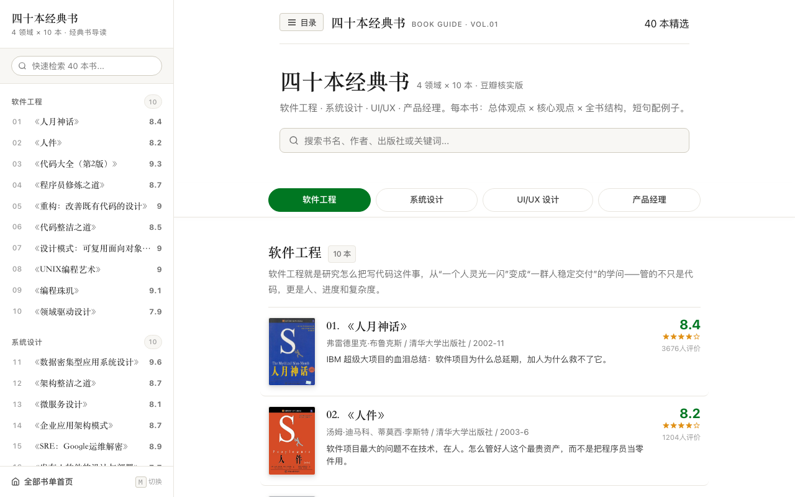

# Forty Classic Books / 四十本经典书

中文：精选软件工程、系统设计、UI/UX 设计、产品经理 4 大核心领域各 10 本豆瓣高分经典，共 40 本书深度导读。每本书包含总体观点、5-8 个核心观点（配实际生动案例）与全书结构剖析，坚持纯干货、说人话。纯静态网页，内置全局搜索与吸顶目录。

English: Curated reading guide for 40 classic books across 4 core domains: Software Engineering, System Design, UI/UX Design, and Product Management (10 books per domain). Each book features core concepts with real-world examples and structured outlines. Zero-dependency static site with instant search.



## 在线体验 / Live Demo

- [Cloudflare Demo](https://forty-classic-books.xiaosang.cc/)
- [GitHub Repo](https://github.com/holynova/forty-classic-books)


## 本地运行 / Run locally

```bash
node scripts/build.js
```

## 发布 / Deploy

```bash
npx wrangler deploy --config wrangler.jsonc
```

Cloudflare Workers · Custom Domain: `forty-classic-books.xiaosang.cc`

源码与部署配置使用同一个主分支；在本地手动发布，不创建 Cloudflare 专用分支或 GitHub Action。
